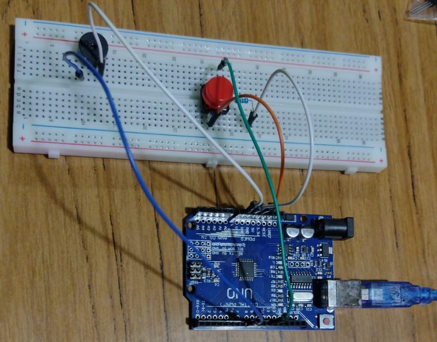
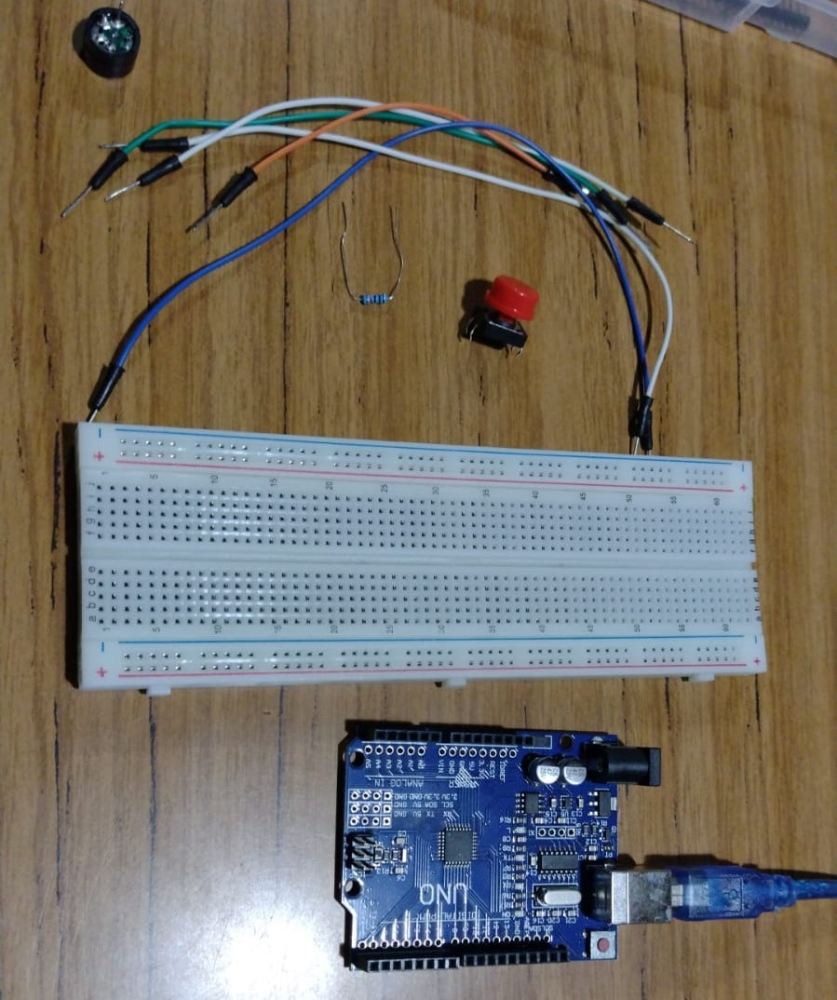

# Buzzer Melody with Pushbutton

Hardware required:
- Arduino Uno
- Buzzer
- Button
- 10k ohm resistors
- wires
- breadboard

## Source 

- [Buzzer Melody with Pushbutton and Arduino](https://www.youtube.com/watch?v=PLRkk5dYxcs)
- [Play a Melody using the tone() function](https://www.arduino.cc/en/Tutorial/BuiltInExamples/toneMelody)