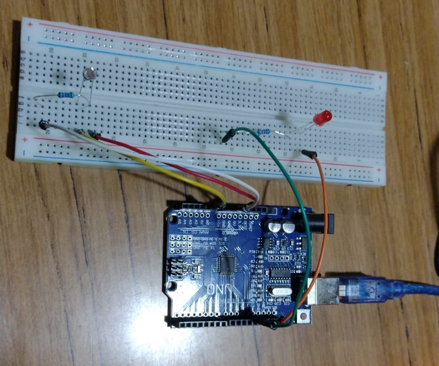

# LED Control with LDR

Hardware required:
- Arduino Uno
- LED
- LDR
- 220 and 10k ohm resistors
- wires
- breadboard

## Source 

- [LED Control with LDR (Photoresistor) and Arduino](https://www.youtube.com/watch?v=4fN1aJMH9mM)